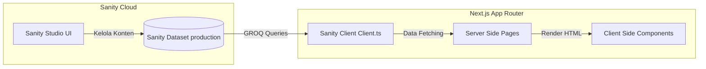

# 📚 Dokumentasi Portfolio 2026

Selamat datang di repositori dokumentasi untuk proyek **Portfolio 2026**. Proyek ini merupakan website portfolio pribadi modern dengan arsitektur **Headless CMS**, memisahkan sisi tampilan (Frontend) dan pengelolaan konten (Backend/CMS).

Proyek ini terbagi menjadi dua bagian utama:
1. **Frontend**: Dibangun menggunakan **Next.js 16** (React 19) dengan **Tailwind CSS v4** dan **Framer Motion**.
2. **Sanity Studio**: Sebagai sistem pengelolaan konten (CMS) berbasis schema-driven yang di-host di cloud Sanity.io.

---

## 🗺️ Peta Dokumentasi

Untuk detail masing-masing bagian, silakan buka dokumen di bawah ini:

| Bagian | Deskripsi Dokumen | Link Dokumen |
| :--- | :--- | :--- |
| **Frontend (Next.js)** | Panduan setup Next.js, struktur komponen, routing, GROQ queries, styling, dan petunjuk deployment. | [Dokumentasi Frontend ➡️](./frontend/README.md) |
| **Sanity CMS (Studio)** | Penjelasan schema (`project` & `experience`), cara pengelolaan konten, kustomisasi schema, dan deployment studio. | [Dokumentasi Sanity CMS ➡️](./sanity/README.md) |

---

## 🏗️ Alur Arsitektur Proyek

Berikut adalah gambaran sederhana bagaimana Frontend dan CMS saling terhubung:



---

## ⚡ Setup Cepat Proyek Secara Lokal

Untuk menjalankan seluruh proyek di komputer lokal Anda, ikuti langkah berikut:

### Prasyarat
Pastikan Anda sudah menginstal **Bun** (runtime javascript). Jika belum, instal dari [bun.sh](https://bun.sh/).

### Langkah-langkah
1. **Clone repositori** dan masuk ke direktori proyek.
2. **Menjalankan Sanity CMS**:
   ```bash
   cd sanity
   bun install
   bun dev
   ```
   Buka [http://localhost:3333](http://localhost:3333) di browser.
3. **Menjalankan Next.js Frontend**:
   Buka terminal baru, lalu jalankan:
   ```bash
   cd frontend
   bun install
   bun dev
   ```
   Buka [http://localhost:3000](http://localhost:3000) di browser.

Untuk informasi selengkapnya tentang masing-masing modul, silakan baca dokumentasi detail di dalam direktori `frontend` dan `sanity`.
